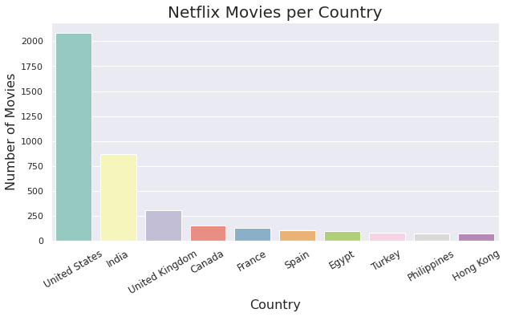
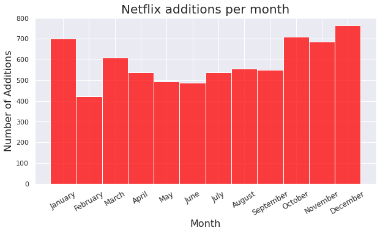
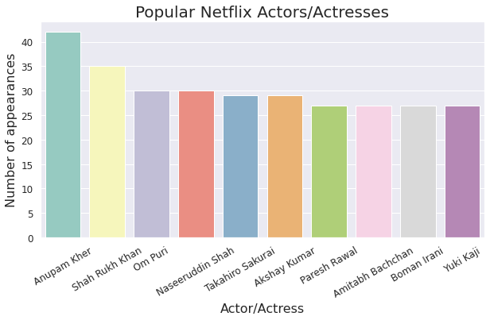
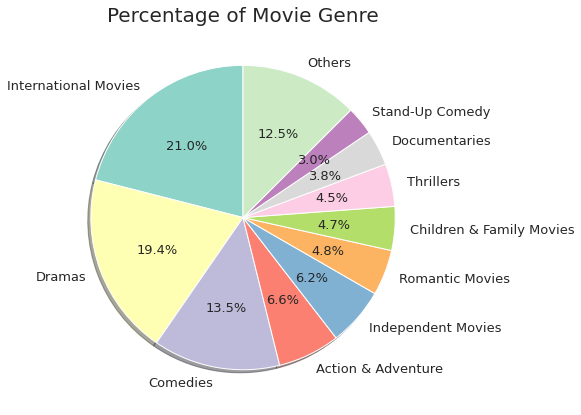

# Netflix Analysis

## Introduction
Netflix is a streaming service that offers a wide variety of TV shows, movies, animes, documentaries, and more on thousands of internet-connected devices.

In this project, we'll be exploring a [dataset available on kaggle](https://www.kaggle.com/shivamb/netflix-shows) containing the information of tv shows and movies available on US Netflix.

## Project
We'll be using data visualizations to answer some questions:
- [How is the catalogue distribution in Movies and TV Shows?](#1.-Distribution-of-Movies/TV-Shows-on-Netflix)
- How many Movies and TV Shows have been added to the Netflix catalogue each year?
- Which countries have made the most Movies and TV Shows?
- Is there a month/season of the year in which there are more additions to the catalogue?
- How is the catalogue distribution in terms of TV Rating?
- What are the most popular Netflix actors/actresses?
- What are the most popular Movies/TV Shows genres?
- What are the most common words on titles of Movies and TV Shows?

## Technologies
- Python
  - Jupyter
  - Numpy
  - Matplotlib
  - Seaborn
  - Squarify
  - Wordcloud

## Data Cleaning
Before working on the visualizations, we have to do some data cleaning:
- Deal with missing information (NaN items in different columns);
- Remove irrelevant data;
- Process and add new data.

## Visualization
### 1. Distribution of Movies/TV Shows on Netflix
There were <strong>7787 titles</strong> available on Netflix - <strong>5377 Movies</strong> and <strong>2410 TV Shows</strong>

### 2) Movies and TV Shows additions throughout the years

### 3) Most common countries
- <strong>United States</strong> has the most productions in <strong>both categories</strong>, Movies and TV Shows
- <strong>India</strong> appears on both categories, but focuses on the production of <strong>Movies</strong>
- <strong>Japan</strong> and <strong>South Korea</strong> have a lot of <strong>TV Shows</strong>, but few Movies

### 4) Season of the year in which there are more additions to the catalogue
There are <strong>more additions</strong> to the Netflix catalogue during the <strong>colder months</strong> of the year (Fall and Winter)

<strong>18.95% more additions</strong> during Fall/Winter when compared to Spring/Summer

### 5) Distribution per TV Rating
Most of the titles available on Netflix are directed towards mature audiences (TV-MA)

### 6) Most popular Actors/Actresses
The majority of actors/actresses that appear in the most number of movies/shows (popular actors) are from <strong>India</strong>

### 7) Most popular genre
In both Movies and TV Shows, the most common genres are <strong>'International'</strong>, <strong>'Dramas'</strong> and <strong>'Comedies'</strong>.

### 8) Most common words on Titles

