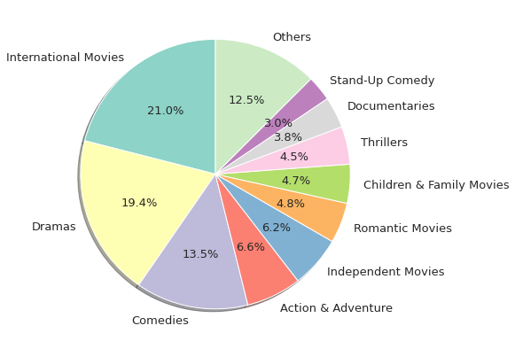

# Visualization

## 1. Distribution of Movies/TV Shows on Netflix
There were <strong>7787 titles</strong> available on Netflix - <strong>5377 Movies</strong> and <strong>2410 TV Shows</strong>

## 2. Movies and TV Shows additions throughout the years

## 3. Most common countries
- <strong>United States</strong> has the most productions in <strong>both categories</strong>, Movies and TV Shows
- <strong>India</strong> appears on both categories, but focuses on the production of <strong>Movies</strong>
- <strong>Japan</strong> and <strong>South Korea</strong> have a lot of <strong>TV Shows</strong>, but few Movies

## 4. Season of the year in which there are more additions to the catalogue
There are <strong>more additions</strong> to the Netflix catalogue during the <strong>colder months</strong> of the year (Fall and Winter)

<strong>18.95% more additions</strong> during Fall/Winter when compared to Spring/Summer

## 5. Distribution per TV Rating
Most of the titles available on Netflix are directed towards mature audiences (TV-MA)

## 6. Most popular Actors/Actresses
The majority of actors/actresses that appear in the most number of Netflix productions (popular actors) are from <strong>India</strong>

## 7. Most popular genre
In both Movies and TV Shows, the most common genres are <strong>'International'</strong>, <strong>'Dramas'</strong> and <strong>'Comedies'</strong>.

## 8. Most common words on Titles
